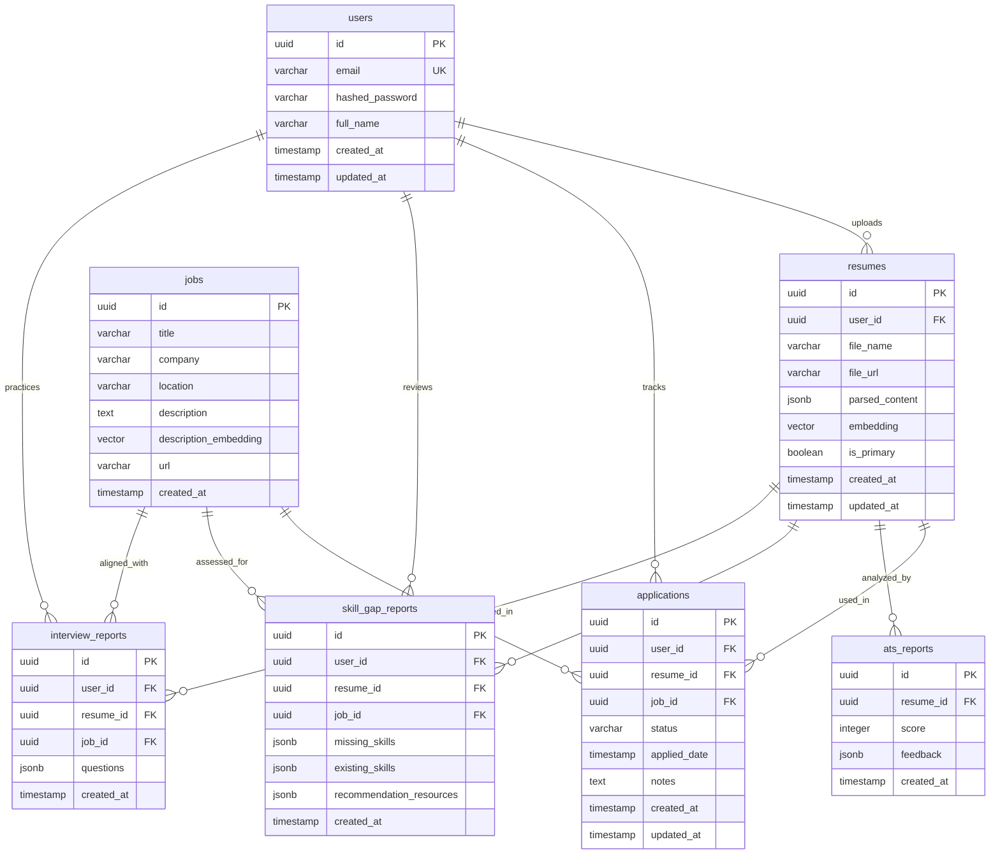

# Database Schema Design

## Project Name: CareerCopilot AI
**Date:** June 18, 2026

---

## 1. Entity-Relationship (ER) Diagram



---

## 2. Table Definitions

The schema is built for **PostgreSQL** (version 15+) and relies on the extension `pgvector` for embedding vector operations.

### 2.1 Users Table (`users`)
Stores system credential profiles and metadata.

| Column Name | Data Type | Constraints | Description |
| :--- | :--- | :--- | :--- |
| `id` | `UUID` | PRIMARY KEY, DEFAULT gen_random_uuid() | Unique identifier |
| `email` | `VARCHAR(255)` | UNIQUE, NOT NULL | Account email address |
| `hashed_password`| `VARCHAR(255)`| NOT NULL | Argon2 / bcrypt hashed password |
| `full_name` | `VARCHAR(100)` | NOT NULL | User's full name |
| `created_at` | `TIMESTAMP` | DEFAULT CURRENT_TIMESTAMP | Creation timestamp |
| `updated_at` | `TIMESTAMP` | DEFAULT CURRENT_TIMESTAMP | Last modification timestamp |

```sql
CREATE TABLE users (
    id UUID PRIMARY KEY DEFAULT gen_random_uuid(),
    email VARCHAR(255) UNIQUE NOT NULL,
    hashed_password VARCHAR(255) NOT NULL,
    full_name VARCHAR(100) NOT NULL,
    created_at TIMESTAMP WITH TIME ZONE DEFAULT CURRENT_TIMESTAMP,
    updated_at TIMESTAMP WITH TIME ZONE DEFAULT CURRENT_TIMESTAMP
);
```

---

### 2.2 Resumes Table (`resumes`)
Holds parsed resume data, PDF references, and pre-calculated text embedding vectors (e.g., dimension size 384 for sentence-transformers `all-MiniLM-L6-v2`).

| Column Name | Data Type | Constraints | Description |
| :--- | :--- | :--- | :--- |
| `id` | `UUID` | PRIMARY KEY, DEFAULT gen_random_uuid() | Unique identifier |
| `user_id` | `UUID` | FOREIGN KEY REFERENCES users(id) ON DELETE CASCADE | Owner of the resume |
| `file_name` | `VARCHAR(255)` | NOT NULL | original upload file name |
| `file_url` | `VARCHAR(512)` | NOT NULL | Path to storage location |
| `parsed_content`| `JSONB` | NOT NULL | Structured JSON of experience, education, skills |
| `embedding` | `VECTOR(384)` | NOT NULL | Semantic embedding vector of resume contents |
| `is_primary` | `BOOLEAN` | DEFAULT FALSE | Flags resume to use as default for analysis |
| `created_at` | `TIMESTAMP` | DEFAULT CURRENT_TIMESTAMP | Creation timestamp |
| `updated_at` | `TIMESTAMP` | DEFAULT CURRENT_TIMESTAMP | Last modification timestamp |

```sql
-- Enable pgvector extension
CREATE EXTENSION IF NOT EXISTS vector;

CREATE TABLE resumes (
    id UUID PRIMARY KEY DEFAULT gen_random_uuid(),
    user_id UUID NOT NULL REFERENCES users(id) ON DELETE CASCADE,
    file_name VARCHAR(255) NOT NULL,
    file_url VARCHAR(512) NOT NULL,
    parsed_content JSONB NOT NULL,
    embedding VECTOR(384) NOT NULL,
    is_primary BOOLEAN DEFAULT FALSE,
    created_at TIMESTAMP WITH TIME ZONE DEFAULT CURRENT_TIMESTAMP,
    updated_at TIMESTAMP WITH TIME ZONE DEFAULT CURRENT_TIMESTAMP
);
```

---

### 2.3 Jobs Table (`jobs`)
Stores target jobs that candidates parse from postings or paste into the system.

| Column Name | Data Type | Constraints | Description |
| :--- | :--- | :--- | :--- |
| `id` | `UUID` | PRIMARY KEY, DEFAULT gen_random_uuid() | Unique identifier |
| `title` | `VARCHAR(255)` | NOT NULL | Job role title |
| `company` | `VARCHAR(255)` | NOT NULL | Company name |
| `location` | `VARCHAR(100)` | NULL | Job location (e.g., Remote, San Francisco, CA) |
| `description` | `TEXT` | NOT NULL | Raw job posting description |
| `description_embedding`| `VECTOR(384)`| NOT NULL | Semantic embedding of job description text |
| `url` | `VARCHAR(512)` | NULL | URL reference of the job posting |
| `created_at` | `TIMESTAMP` | DEFAULT CURRENT_TIMESTAMP | Discovery / storage timestamp |

```sql
CREATE TABLE jobs (
    id UUID PRIMARY KEY DEFAULT gen_random_uuid(),
    title VARCHAR(255) NOT NULL,
    company VARCHAR(255) NOT NULL,
    location VARCHAR(100),
    description TEXT NOT NULL,
    description_embedding VECTOR(384) NOT NULL,
    url VARCHAR(512),
    created_at TIMESTAMP WITH TIME ZONE DEFAULT CURRENT_TIMESTAMP
);
```

---

### 2.4 Applications Table (`applications`)
Tracks active job status applications for the dashboard.

| Column Name | Data Type | Constraints | Description |
| :--- | :--- | :--- | :--- |
| `id` | `UUID` | PRIMARY KEY, DEFAULT gen_random_uuid() | Unique identifier |
| `user_id` | `UUID` | FOREIGN KEY REFERENCES users(id) ON DELETE CASCADE | Associated user |
| `resume_id` | `UUID` | FOREIGN KEY REFERENCES resumes(id) ON DELETE SET NULL | Tailored resume version used for application |
| `job_id` | `UUID` | FOREIGN KEY REFERENCES jobs(id) ON DELETE CASCADE | Target job details |
| `status` | `VARCHAR(50)` | NOT NULL, DEFAULT 'Wishlist' | Status: Wishlist, Applied, Interviewing, Offer, Rejected |
| `applied_date` | `TIMESTAMP` | NULL | Date applied |
| `notes` | `TEXT` | NULL | User custom markdown notes |
| `created_at` | `TIMESTAMP` | DEFAULT CURRENT_TIMESTAMP | Record created at |
| `updated_at` | `TIMESTAMP` | DEFAULT CURRENT_TIMESTAMP | Record updated at |

```sql
CREATE TABLE applications (
    id UUID PRIMARY KEY DEFAULT gen_random_uuid(),
    user_id UUID NOT NULL REFERENCES users(id) ON DELETE CASCADE,
    resume_id UUID REFERENCES resumes(id) ON DELETE SET NULL,
    job_id UUID NOT NULL REFERENCES jobs(id) ON DELETE CASCADE,
    status VARCHAR(50) NOT NULL DEFAULT 'Wishlist',
    applied_date TIMESTAMP WITH TIME ZONE,
    notes TEXT,
    created_at TIMESTAMP WITH TIME ZONE DEFAULT CURRENT_TIMESTAMP,
    updated_at TIMESTAMP WITH TIME ZONE DEFAULT CURRENT_TIMESTAMP
);
```

---

### 2.5 ATS Reports Table (`ats_reports`)
Contains analysis of specific resume compatibility with standard applicant tracking parameters.

| Column Name | Data Type | Constraints | Description |
| :--- | :--- | :--- | :--- |
| `id` | `UUID` | PRIMARY KEY, DEFAULT gen_random_uuid() | Unique identifier |
| `resume_id` | `UUID` | FOREIGN KEY REFERENCES resumes(id) ON DELETE CASCADE | Linked resume |
| `score` | `INTEGER` | NOT NULL, CHECK (score >= 0 AND score <= 100) | Calculated performance score |
| `feedback` | `JSONB` | NOT NULL | Array of warnings, style recommendations, and issues |
| `created_at` | `TIMESTAMP` | DEFAULT CURRENT_TIMESTAMP | Calculation timestamp |

```sql
CREATE TABLE ats_reports (
    id UUID PRIMARY KEY DEFAULT gen_random_uuid(),
    resume_id UUID NOT NULL REFERENCES resumes(id) ON DELETE CASCADE,
    score INTEGER NOT NULL CHECK (score >= 0 AND score <= 100),
    feedback JSONB NOT NULL, -- Format: { formatting_tips: [...], grammar_issues: [...], keyword_suggestions: [...] }
    created_at TIMESTAMP WITH TIME ZONE DEFAULT CURRENT_TIMESTAMP
);
```

---

### 2.6 Skill Gap Reports Table (`skill_gap_reports`)
Contains side-by-side gap metrics comparing a resume directly against a job requirement.

| Column Name | Data Type | Constraints | Description |
| :--- | :--- | :--- | :--- |
| `id` | `UUID` | PRIMARY KEY, DEFAULT gen_random_uuid() | Unique identifier |
| `user_id` | `UUID` | FOREIGN KEY REFERENCES users(id) ON DELETE CASCADE | Associated user |
| `resume_id` | `UUID` | FOREIGN KEY REFERENCES resumes(id) ON DELETE CASCADE | Resume parsed for comparison |
| `job_id` | `UUID` | FOREIGN KEY REFERENCES jobs(id) ON DELETE CASCADE | Job criteria |
| `missing_skills`| `JSONB` | NOT NULL | Array of soft/hard skills present in JD but not resume |
| `existing_skills`| `JSONB` | NOT NULL | Array of matching skills found in both |
| `recommendation_resources`| `JSONB` | NOT NULL | Array of suggested courses/projects to build skills |
| `created_at` | `TIMESTAMP` | DEFAULT CURRENT_TIMESTAMP | Analysis timestamp |

```sql
CREATE TABLE skill_gap_reports (
    id UUID PRIMARY KEY DEFAULT gen_random_uuid(),
    user_id UUID NOT NULL REFERENCES users(id) ON DELETE CASCADE,
    resume_id UUID NOT NULL REFERENCES resumes(id) ON DELETE CASCADE,
    job_id UUID NOT NULL REFERENCES jobs(id) ON DELETE CASCADE,
    missing_skills JSONB NOT NULL,
    existing_skills JSONB NOT NULL,
    recommendation_resources JSONB NOT NULL, -- Format: [{ skill: "Docker", courses: [{ name: "Docker Course", url: "..." }] }]
    created_at TIMESTAMP WITH TIME ZONE DEFAULT CURRENT_TIMESTAMP
);
```

---

### 2.7 Interview Reports Table (`interview_reports`)
Generates mock questions and sample answers tailored to a resume and job description.

| Column Name | Data Type | Constraints | Description |
| :--- | :--- | :--- | :--- |
| `id` | `UUID` | PRIMARY KEY, DEFAULT gen_random_uuid() | Unique identifier |
| `user_id` | `UUID` | FOREIGN KEY REFERENCES users(id) ON DELETE CASCADE | Associated user |
| `resume_id` | `UUID` | FOREIGN KEY REFERENCES resumes(id) ON DELETE CASCADE | Interview matching resume context |
| `job_id` | `UUID` | FOREIGN KEY REFERENCES jobs(id) ON DELETE CASCADE | Interview matching job context |
| `questions` | `JSONB` | NOT NULL | Array of behavior, technical, and resume questions with suggestions |
| `created_at` | `TIMESTAMP` | DEFAULT CURRENT_TIMESTAMP | Generation timestamp |

```sql
CREATE TABLE interview_reports (
    id UUID PRIMARY KEY DEFAULT gen_random_uuid(),
    user_id UUID NOT NULL REFERENCES users(id) ON DELETE CASCADE,
    resume_id UUID NOT NULL REFERENCES resumes(id) ON DELETE CASCADE,
    job_id UUID NOT NULL REFERENCES jobs(id) ON DELETE CASCADE,
    questions JSONB NOT NULL, -- Format: [{ question: "...", category: "behavioral", sample_answer: "...", tips: "..." }]
    created_at TIMESTAMP WITH TIME ZONE DEFAULT CURRENT_TIMESTAMP
);
```

---

## 3. Recommended Indexes

Indexes should be configured on Foreign Keys and columns used frequently in filtering or sorting. In addition, an **HNSW (Hierarchical Navigable Small World)** index should be built on vector columns to support fast approximate nearest neighbor (ANN) searches.

```sql
-- Indexes for performance
CREATE INDEX idx_resumes_user_id ON resumes(user_id);
CREATE INDEX idx_applications_user_id ON applications(user_id);
CREATE INDEX idx_applications_job_id ON applications(job_id);
CREATE INDEX idx_ats_reports_resume_id ON ats_reports(resume_id);

-- Indexes for report retrieval
CREATE INDEX idx_skill_gap_user_job ON skill_gap_reports(user_id, job_id);
CREATE INDEX idx_interview_reports_user_job ON interview_reports(user_id, job_id);

-- Vector Search HNSW Indexes (using Cosine distance metric)
-- Note: pgvector supports HNSW with ivfflat index options. HNSW is recommended for precision and speed.
CREATE INDEX idx_resumes_embedding ON resumes USING hnsw (embedding vector_cosine_ops);
CREATE INDEX idx_jobs_embedding ON jobs USING hnsw (description_embedding vector_cosine_ops);
```
