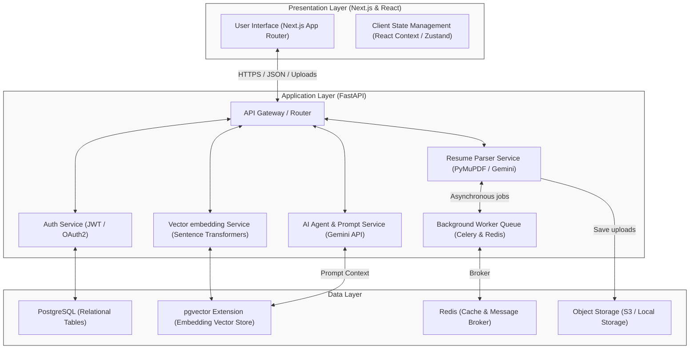
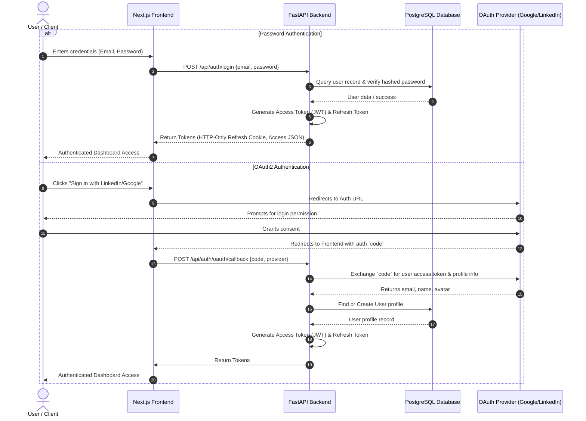
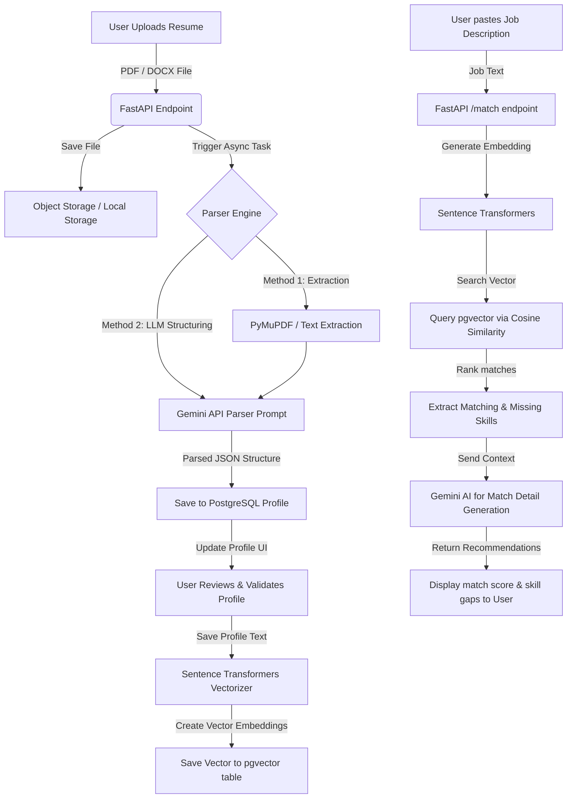
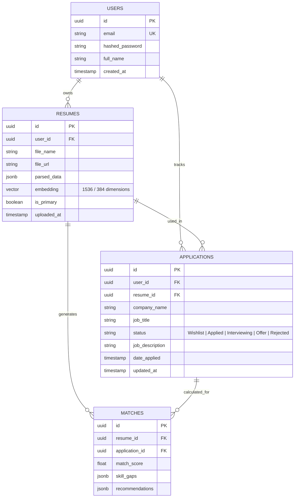

# System Design Document

## Project Name: CareerCopilot AI
**Date:** June 18, 2026

---

## 1. High-Level Architecture

CareerCopilot AI follows a decoupled, client-server architecture. The system is divided into three primary tiers: Presentation (Next.js Frontend), Application (FastAPI Backend), and Data (PostgreSQL with pgvector).



### Component Breakdown
1.  **Frontend (Next.js):** Served as a single-page application using Next.js App Router. It communicates with the backend via RESTful APIs. TailwindCSS is used for responsive UI styling.
2.  **Backend (FastAPI):** Python-based asynchronous framework. Handles authentication, business logic, background document processing, and interacts with LLM providers.
3.  **Vector Generator (Sentence Transformers):** A lightweight HuggingFace model run locally/inside the backend container to convert resume text and job descriptions into vector embeddings (e.g., using `all-MiniLM-L6-v2`).
4.  **Database (PostgreSQL + pgvector):** Stores transactional data (users, jobs, application states) and performs fast cosine similarity searches directly in SQL queries via `pgvector`.
5.  **External AI (Gemini API):** Performs complex tasks like ATS scoring analysis, custom cover letter compilation, resume tailoring recommendations, and mock interview question generation.

---

## 2. Authentication Flow

The application uses standard JSON Web Tokens (JWT) for stateless session management, supporting both Username/Password credentials and third-party OAuth2 (LinkedIn/Google).



---

## 3. Core Data Flow: Resume Processing & Job Matching



---

## 4. Database Schema (Entities & pgvector)



---

## 5. Directory & Folder Structure

```text
CareerCopilotAI/
├── backend/
│   ├── app/
│   │   ├── api/
│   │   │   ├── v1/
│   │   │   │   ├── endpoints/
│   │   │   │   │   ├── auth.py
│   │   │   │   │   ├── resumes.py
│   │   │   │   │   ├── jobs.py
│   │   │   │   │   └── tracking.py
│   │   │   │   └── api.py
│   │   │   └── deps.py
│   │   ├── core/
│   │   │   ├── config.py
│   │   │   ├── security.py
│   │   │   └── database.py
│   │   ├── models/
│   │   │   ├── user.py
│   │   │   ├── resume.py
│   │   │   └── application.py
│   │   ├── schemas/
│   │   │   ├── user.py
│   │   │   ├── resume.py
│   │   │   └── application.py
│   │   ├── services/
│   │   │   ├── ai.py              # Gemini API Client
│   │   │   ├── parser.py          # Resume document parsing
│   │   │   └── embedder.py        # Sentence Transformers model loader
│   │   ├── main.py
│   │   └── worker.py              # Background Celery worker
│   ├── tests/
│   ├── requirements.txt
│   └── Dockerfile
├── frontend/
│   ├── src/
│   │   ├── app/                   # Next.js App Router folders
│   │   │   ├── layout.tsx
│   │   │   ├── page.tsx
│   │   │   ├── dashboard/
│   │   │   ├── resume/
│   │   │   └── tracking/
│   │   ├── components/            # Reusable UI Components
│   │   │   ├── ui/                # Core elements (buttons, inputs)
│   │   │   ├── dashboard/
│   │   │   └── tracking/
│   │   ├── hooks/                 # Custom React Hooks
│   │   ├── lib/                   # Utility scripts (API client, helpers)
│   │   └── context/               # Global state contexts
│   ├── public/
│   ├── package.json
│   ├── tsconfig.json
│   ├── tailwind.config.js
│   └── postcss.config.js
├── docs/
│   ├── PRD.md
│   └── SYSTEM_DESIGN.md
├── prompts/
│   ├── parser_prompt.txt          # LLM resume parsing instruction
│   ├── ats_scoring.txt            # ATS layout check prompt
│   └── interview_questions.txt    # Interview prep template
├── .gitignore
└── README.md
```
